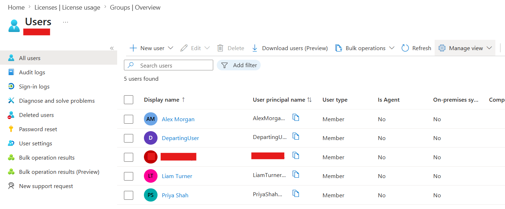
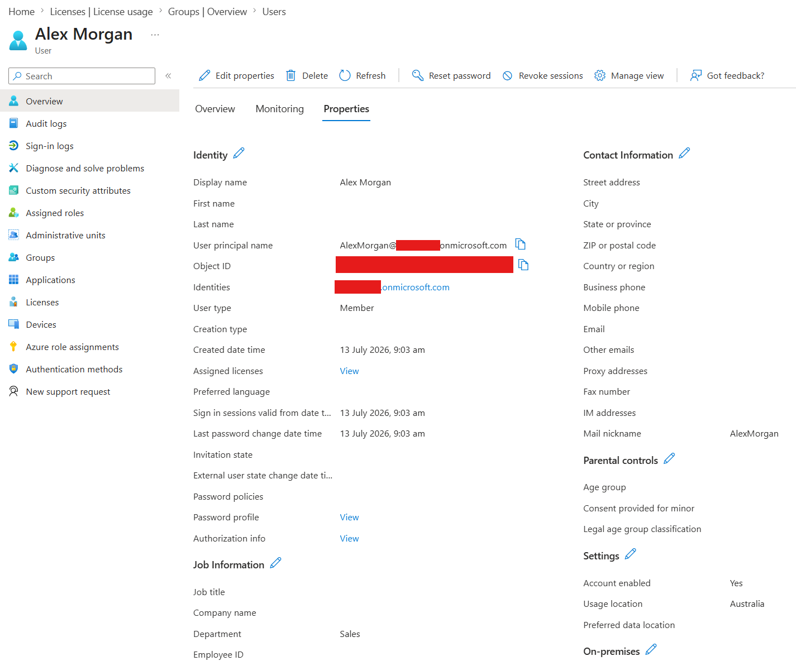

# Create Users

## Objective

Create and configure standard user accounts in Microsoft Entra ID.

## Actions Performed

- Created three standard member accounts.
- Configured display names and user principal names.
- Assigned department information and Australian usage locations.
- Verified the accounts appeared in the Entra user directory.

## Evidence

## Key Takeaways

User accounts can be centrally created and managed through Microsoft Entra ID. Profile attributes such as department and usage location help support administration, licensing and access management.
