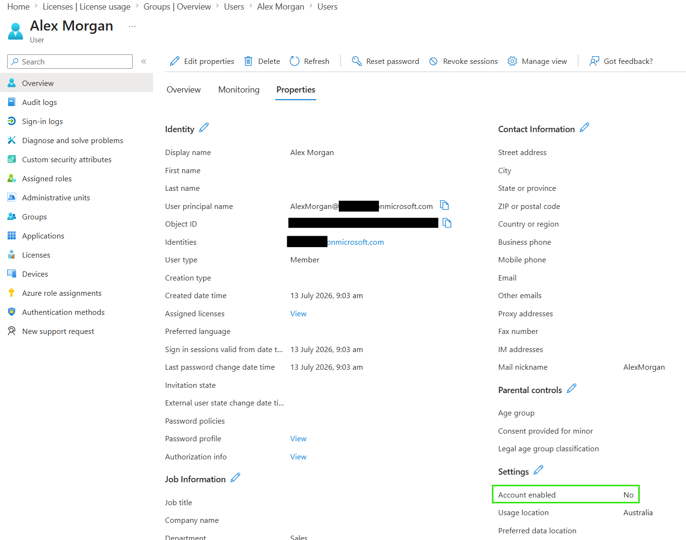

# Block a User from Signing In

## Objective

Disable a Microsoft Entra ID user account to prevent further sign-ins while preserving the user object and its associated data.

## Actions Performed

- Opened the user account in Microsoft Entra ID.
- Changed the account status from enabled to disabled.
- Verified that the account was no longer enabled for sign-in.

## Evidence

### Account Disabled

## Key Takeaways

Blocking sign-in prevents a user from authenticating without deleting the account. This is useful during employee offboarding, security incidents, or when temporary access suspension is required.
