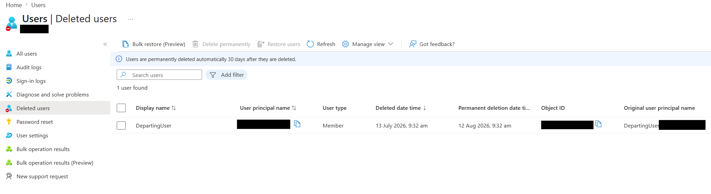
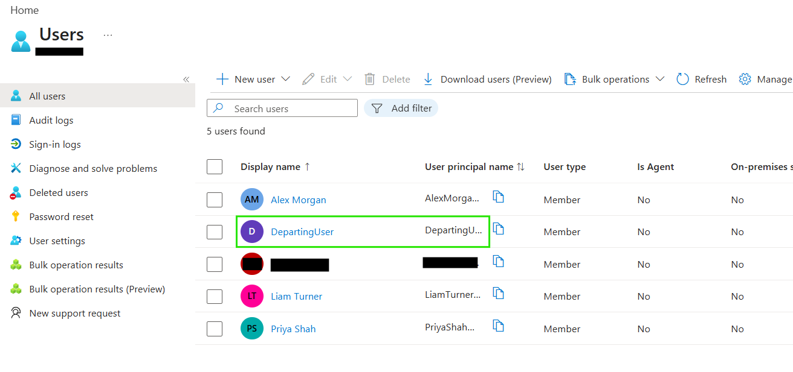

# Delete and Restore Users

## Objective

Delete a Microsoft Entra ID user, confirm the account enters the deleted-users state, then restore it to the active directory.

## Actions Performed

- Deleted a user from Microsoft Entra ID.
- Verified the account appeared under Deleted users.
- Restored the deleted account.
- Confirmed the user returned to the active user directory.

## Evidence

### User Deleted

### User Restored

## Key Takeaways

Deleted Microsoft Entra users remain recoverable for a limited retention period unless permanently deleted. Restoring a user returns the account to the active directory without needing to recreate it manually.
