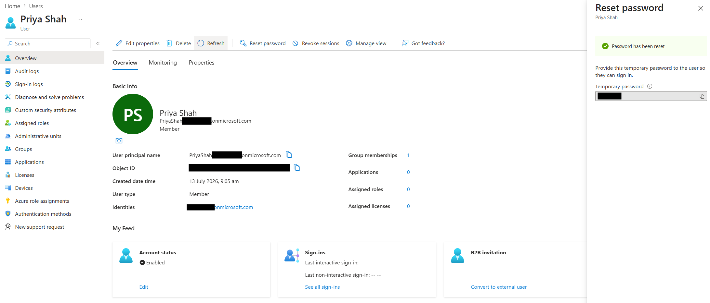

# Reset User Passwords

## Objective

Reset a Microsoft Entra ID user's password and understand the temporary password process used to restore account access.

## Actions Performed

- Opened a user account in Microsoft Entra ID.
- Performed an administrator-initiated password reset.
- Generated a temporary password for the user.
- Confirmed that the user would be required to change the password at the next sign-in.

## Evidence

### Password Reset

## Key Takeaways

Administrators can reset user passwords to restore account access when users forget or lose access to their credentials. Microsoft Entra ID generates a temporary password that the user must replace during the next sign-in.
