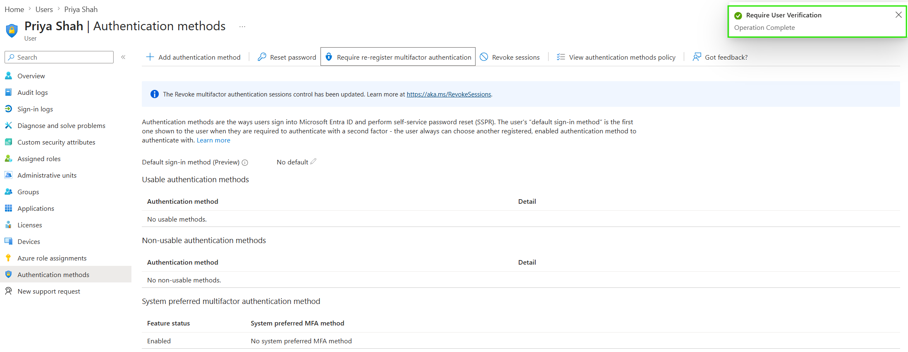

# Reset MFA Registration

## Objective

Reset a Microsoft Entra ID user's multifactor authentication registration and require the user to configure new authentication methods.

## Actions Performed

- Opened the user's authentication methods in Microsoft Entra ID.
- Required the user to re-register for multifactor authentication.
- Confirmed that the existing MFA registration was reset.
- Verified that the user would be required to register a new MFA method when authentication required it.

## Evidence

### MFA Re-registration Required

## Key Takeaways

Administrators can require users to re-register for MFA when authentication methods are lost, replaced, or no longer functioning correctly. This allows the user to configure new authentication methods without recreating the account.
