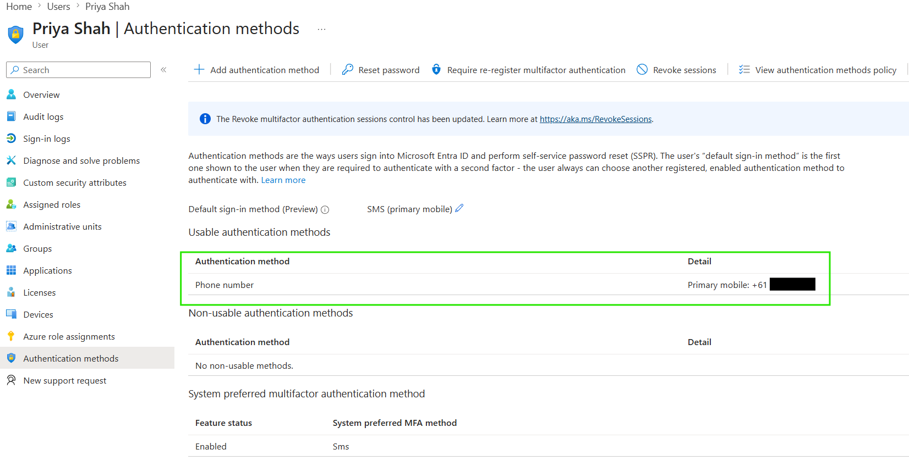
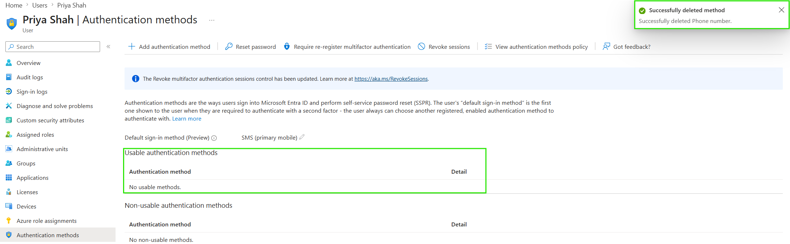

# Remove Authentication Methods

## Objective

Configure and remove a test authentication method from a Microsoft Entra ID user account.

## Actions Performed

- Created a security group for MFA testing.
- Added a fictional lab user to the group.
- Enabled SMS authentication for the selected group.
- Added a test mobile phone as an authentication method.
- Removed the phone authentication method from the user account.
- Verified that the method was no longer registered.

## Evidence

### Authentication Method Registered

### Authentication Method Removed

## Key Takeaways

Microsoft Entra ID allows authentication methods to be scoped to selected groups through policy. Administrators can also remove individual authentication methods when a device is lost, replaced, compromised, or no longer required.
