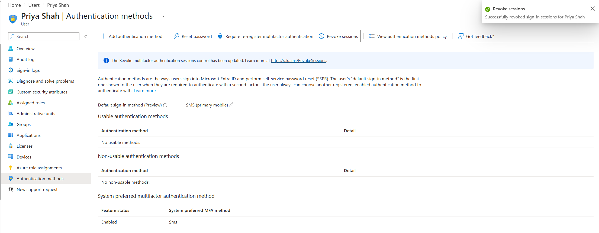

# Revoke User Sessions

## Objective

Revoke a Microsoft Entra ID user's active sign-in sessions to require reauthentication and invalidate existing refresh tokens.

## Actions Performed

- Opened a user account in Microsoft Entra ID.
- Revoked the user's active sign-in sessions.
- Confirmed that existing refresh tokens were invalidated.
- Reviewed how session revocation affects future authentication.

## Evidence

### User Sessions Revoked

## Key Takeaways

Revoking user sessions invalidates existing refresh tokens and requires the user to authenticate again when new access is required. This is useful when responding to suspected account compromise, lost devices, or other security concerns.
