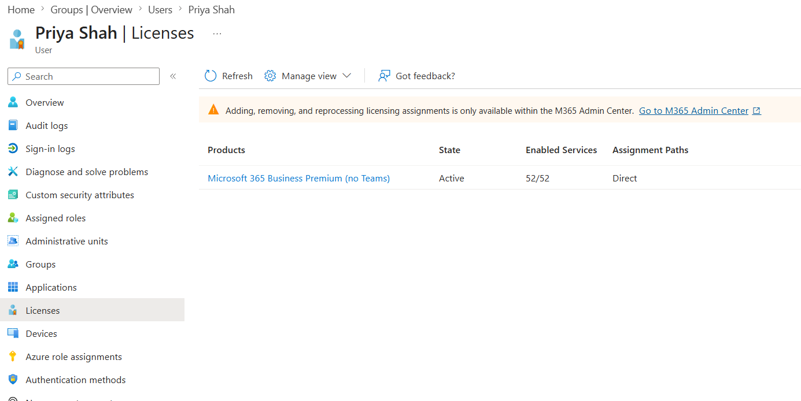
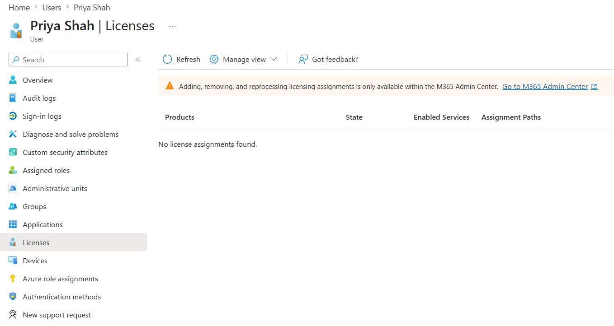

# Assign and Remove Licences

## Objective

Assign and remove a Microsoft 365 product licence from a user account.

## Actions Performed

- Opened a user account in the Microsoft 365 admin centre.
- Assigned an available Microsoft 365 product licence.
- Verified that the licence was successfully applied.
- Removed the licence from the user.
- Confirmed that the licence was no longer assigned.

## Evidence

### Licence Assigned

### Licence Removed

## Key Takeaways

Microsoft 365 licences can be assigned directly to individual users or inherited through licensed groups. Direct licence assignments remain attached to the user until explicitly removed, while group-based licences follow group membership.
