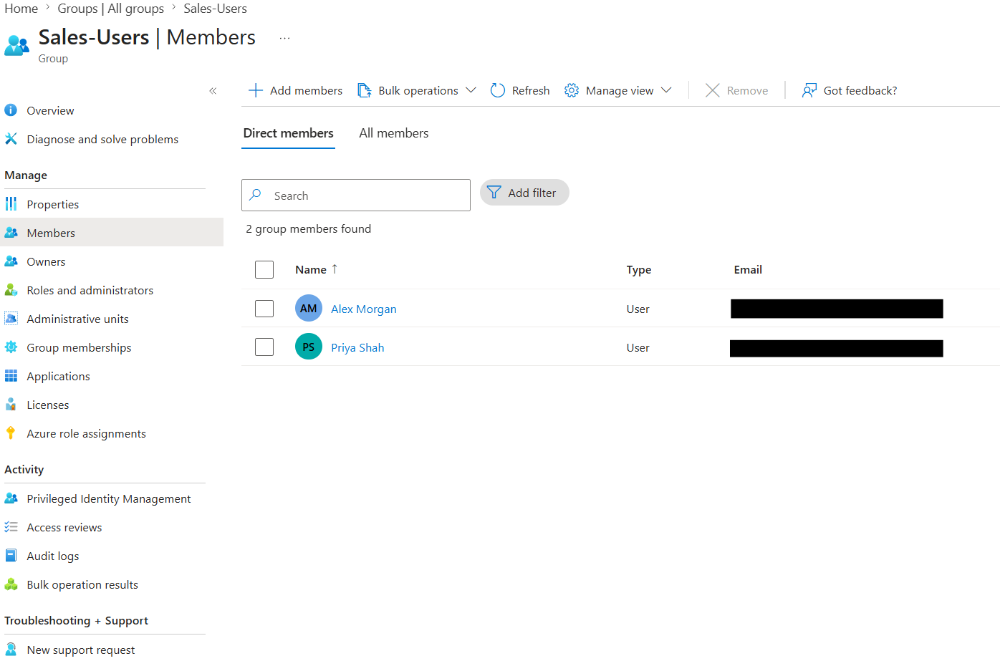
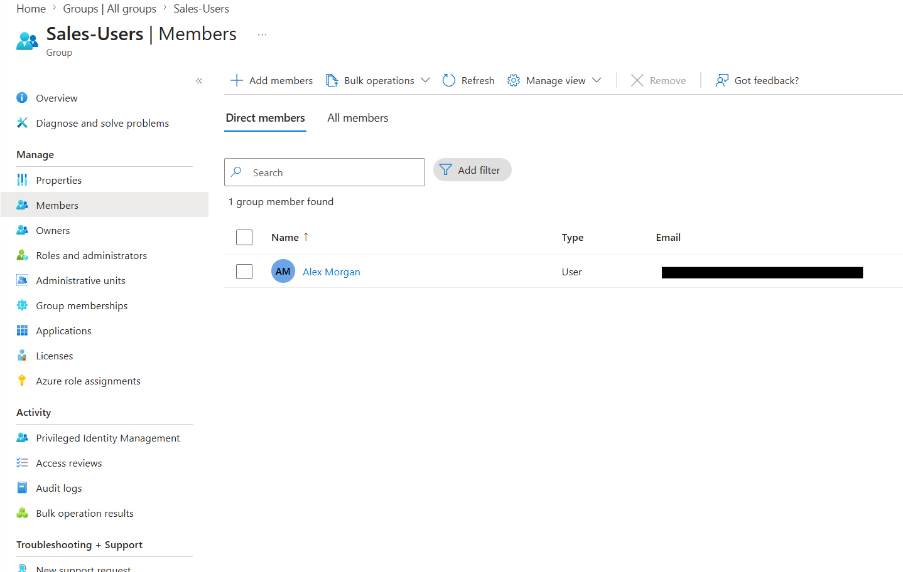

# Create and Manage Groups

## Objective

Create and manage a Microsoft Entra ID security group and control its user membership.

## Actions Performed

- Created an assigned security group in Microsoft Entra ID.
- Added fictional lab users as group members.
- Reviewed the group's membership.
- Removed a user from the group.
- Verified the final membership state.

## Evidence

### Group Members Added

### Group Member Removed

## Key Takeaways

Microsoft Entra security groups simplify access and permission management by allowing administrators to manage users collectively. Assigned groups use manually controlled membership, while dynamic groups can automatically add or remove members based on user or device attributes.
