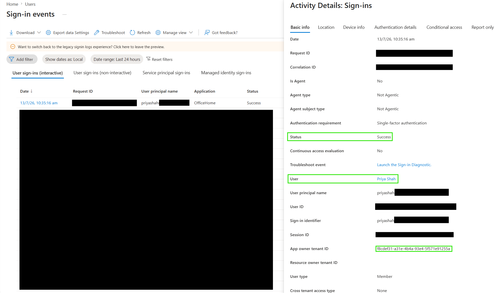
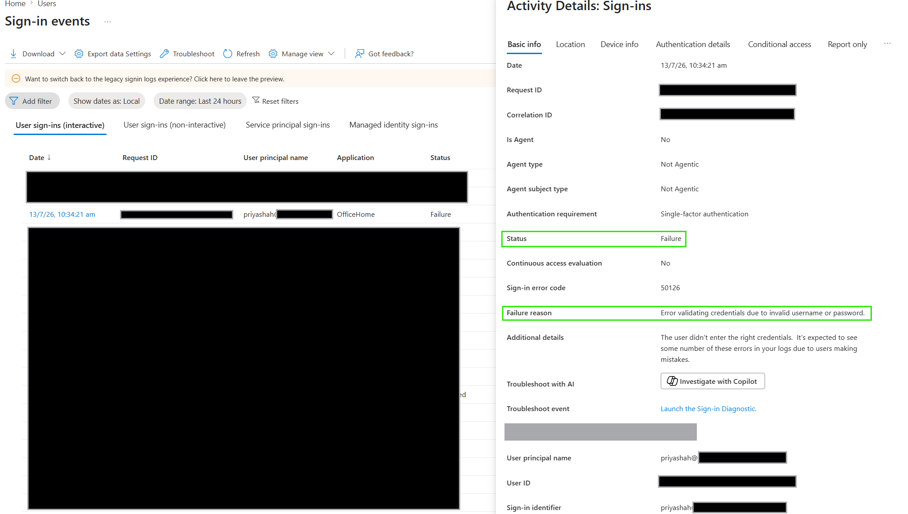

# Read Basic Entra Sign-In Logs

## Objective

Review Microsoft Entra ID sign-in logs to identify successful and failed authentication attempts and examine their associated details.

## Actions Performed

- Generated successful and failed sign-in events using a fictional lab user.
- Opened the Microsoft Entra sign-in logs.
- Filtered authentication events by user.
- Reviewed sign-in status, application, location, error code, and failure reason.
- Distinguished successful authentication from a failed sign-in attempt.

## Evidence

### Successful Sign-In

### Failed Sign-In

## Key Takeaways

Microsoft Entra sign-in logs provide detailed authentication information that can be used to investigate user access issues. Successful and failed sign-ins can be filtered by user and examined using details such as application, status, error code, failure reason, location, and authentication information.
