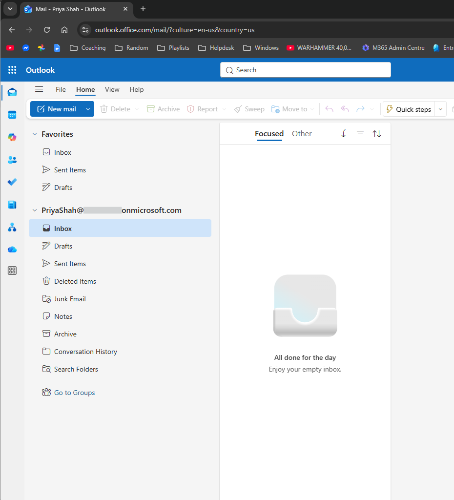
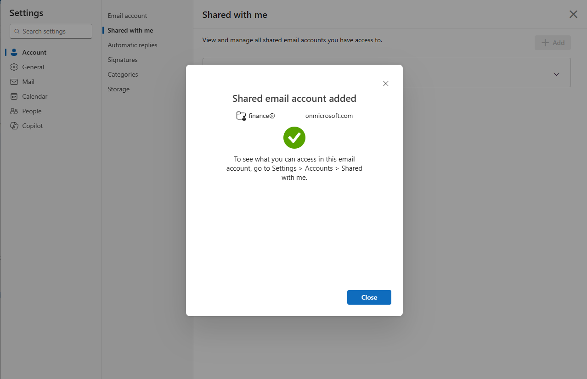
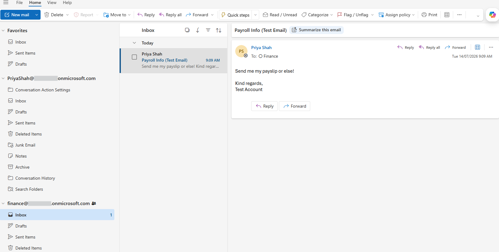

# Shared Mailbox Configuration

## Overview

Created and configured a shared Finance mailbox in Exchange Online.

The mailbox was manually connected to an authorised user's Outlook account after it did not appear automatically.

## Validation

A test email was sent to the Finance shared mailbox and successfully received.

## Skills Demonstrated

- Creating shared mailboxes
- Assigning mailbox access
- Connecting shared mailboxes in Outlook
- Validating mail delivery

## Evidence

