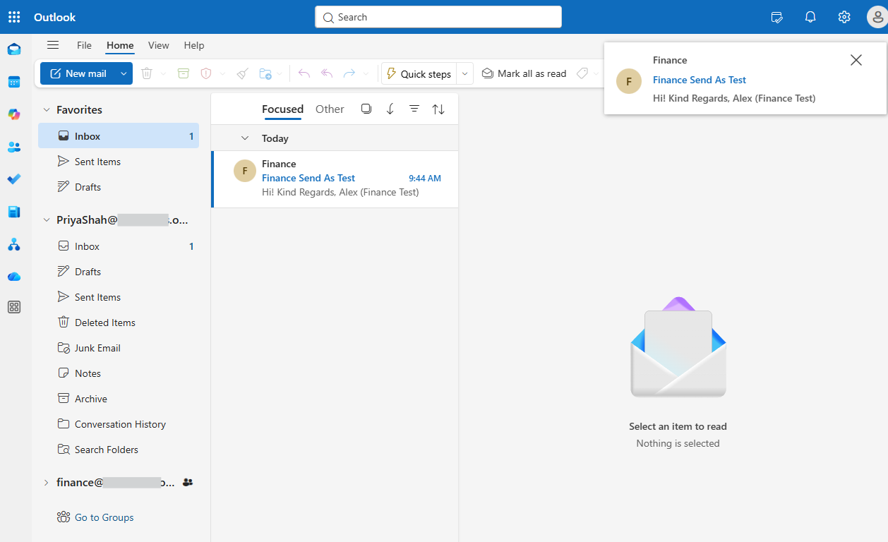
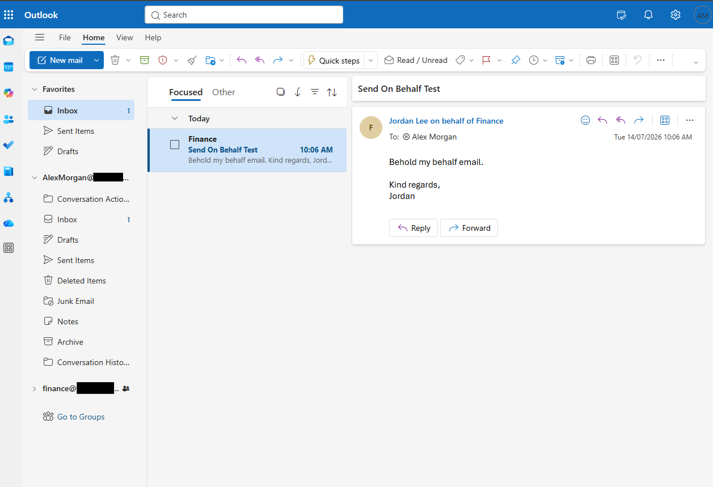

# Mailbox Delegation

## Overview

Configured and tested Exchange Online mailbox delegation permissions for the Finance shared mailbox.

The project demonstrated the difference between **Send As** and **Send on Behalf** permissions.

## Skills Demonstrated

- Configuring mailbox delegation
- Managing Send As permissions
- Configuring Send on Behalf with Exchange Online PowerShell
- Testing delegated mailbox permissions
- Understanding delegate permission behaviour

## Validation

### Send As

The recipient received the message directly from the Finance shared mailbox.

### Send on Behalf

The recipient received the message showing the delegated user acting on behalf of the Finance shared mailbox.

## Outcome

Successfully configured and validated two Exchange Online mailbox delegation methods and demonstrated the practical difference between sending as a mailbox and sending on behalf of a mailbox.