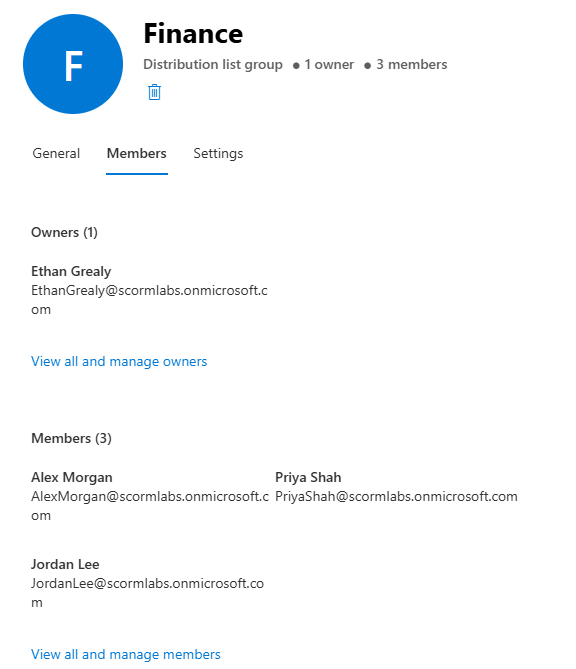
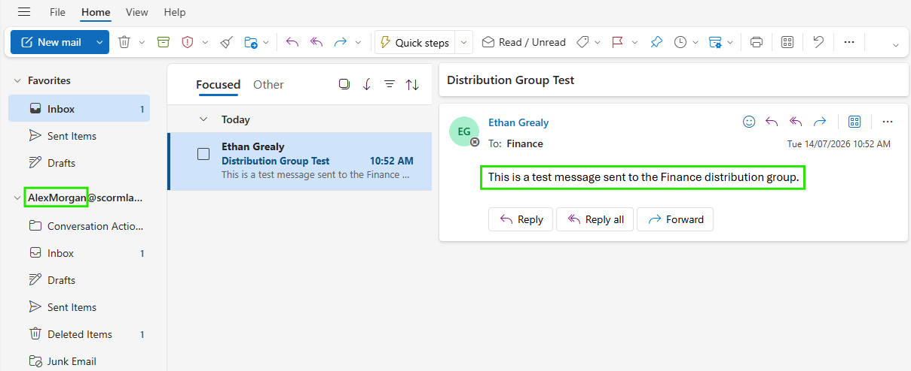

# Distribution Group

## Overview

Created and configured a Finance distribution group in Exchange Online with multiple user members.

## Skills Demonstrated

- Creating distribution groups
- Assigning group owners
- Managing group membership
- Testing mail delivery to group members

## Validation

The Finance distribution group was configured with three members.

A test message was sent to the distribution group and successfully delivered to a member.

