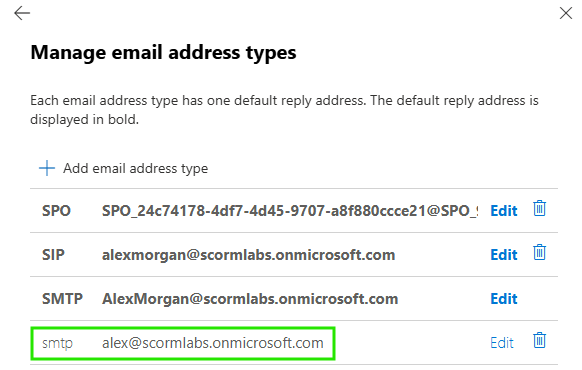
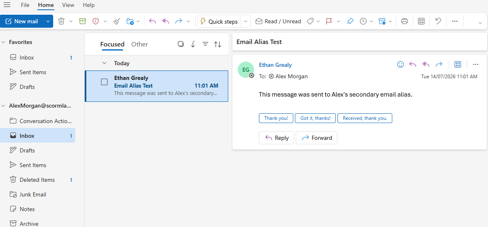

# Mailbox Alias

## Overview

Added a secondary email alias to a user mailbox in Exchange Online and confirmed successful mail delivery.

## Skills Demonstrated

- Managing mailbox email addresses
- Adding secondary SMTP aliases
- Testing alias-based mail delivery

## Validation

The alias `alex@scormlabs.onmicrosoft.com` was added to Alex Morgan's mailbox.

A test email was sent to the alias and successfully delivered to Alex's mailbox.

