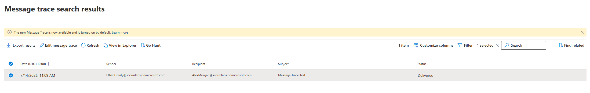
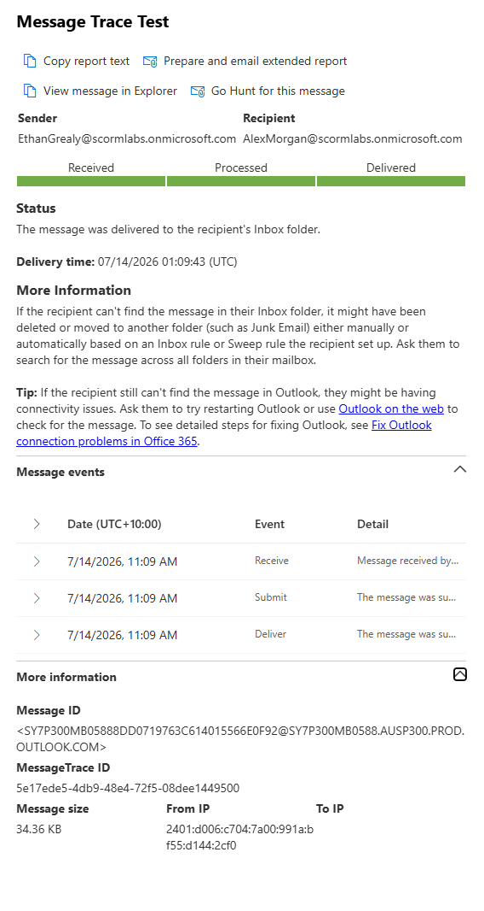

# Message Trace

## Overview

Used Exchange Online Message Trace to investigate and confirm successful email delivery between two user mailboxes.

## Skills Demonstrated

- Running message traces
- Investigating mail delivery status
- Reviewing message-processing events
- Confirming successful delivery

## Validation

The message trace confirmed that the test email was successfully delivered.

Detailed message events confirmed the message was received, processed, and delivered to the recipient's inbox.

