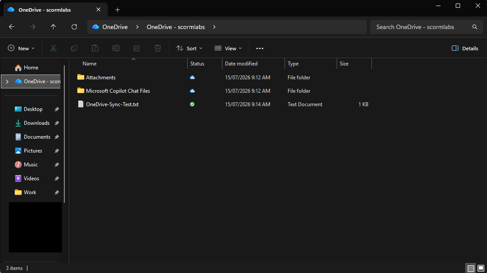
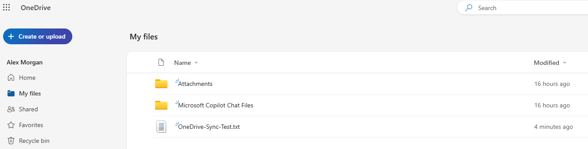

# OneDrive Sync Fundamentals

## Overview

Configured the OneDrive desktop sync client and validated successful file synchronisation between Windows and OneDrive on the web.

## Skills Demonstrated

- Configuring OneDrive for a work account
- Using the local OneDrive folder in File Explorer
- Validating successful cloud synchronisation

## Validation

A test file was created in the local OneDrive folder.

The same file successfully appeared in OneDrive on the web.

