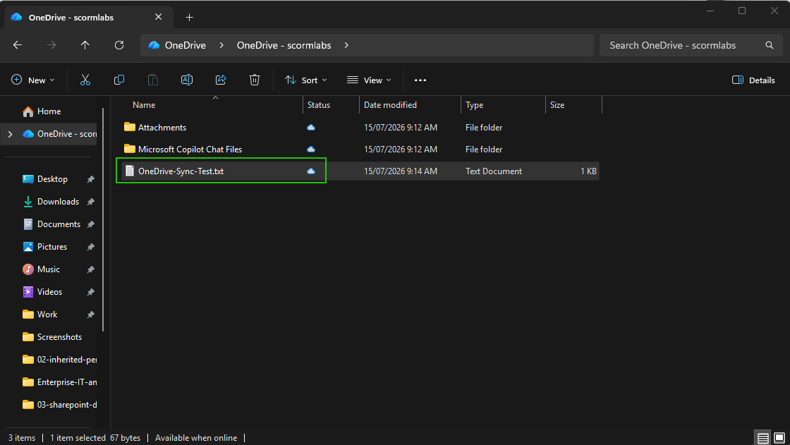
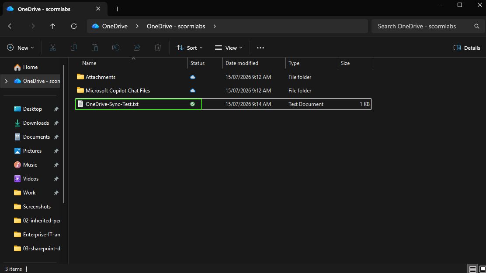
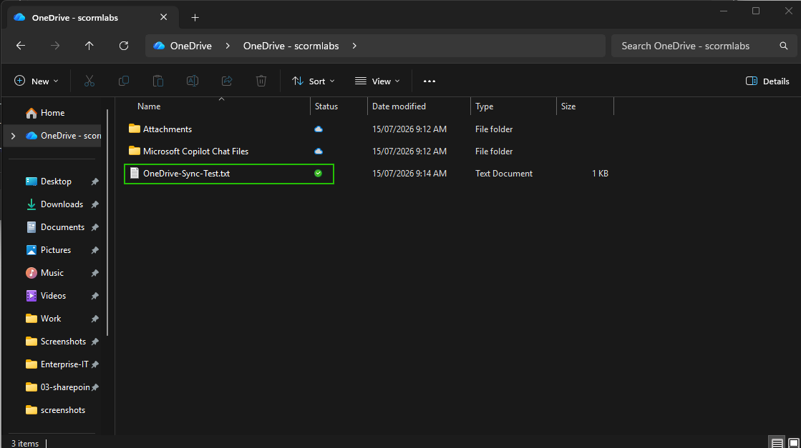

# OneDrive Files On-Demand

## Overview

Tested OneDrive Files On-Demand by changing a synced file between online-only, locally available, and always available states.

## Skills Demonstrated

- Understanding OneDrive availability states
- Managing local disk usage
- Making files available offline
- Using Files On-Demand in File Explorer

## Validation

The file was configured as online-only.

Opening the file downloaded it and made it locally available.

The file was then configured to always remain available on the device.

