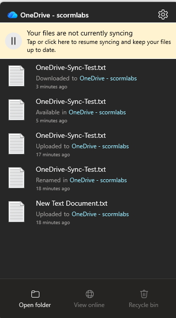
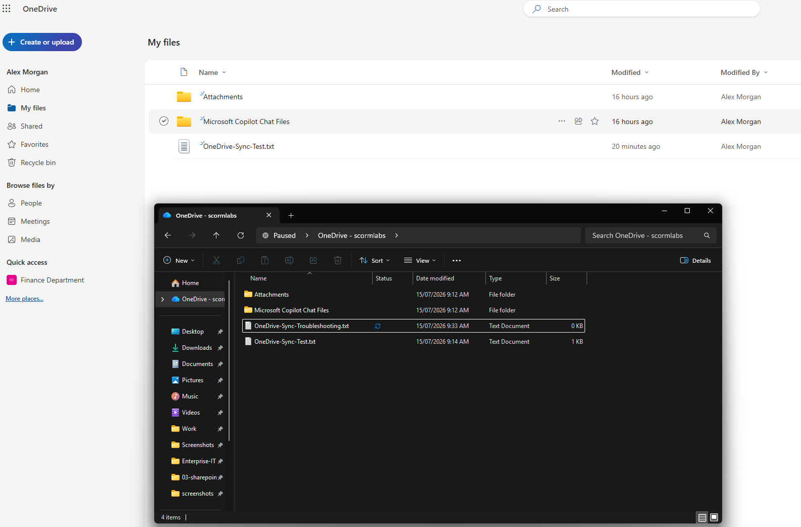
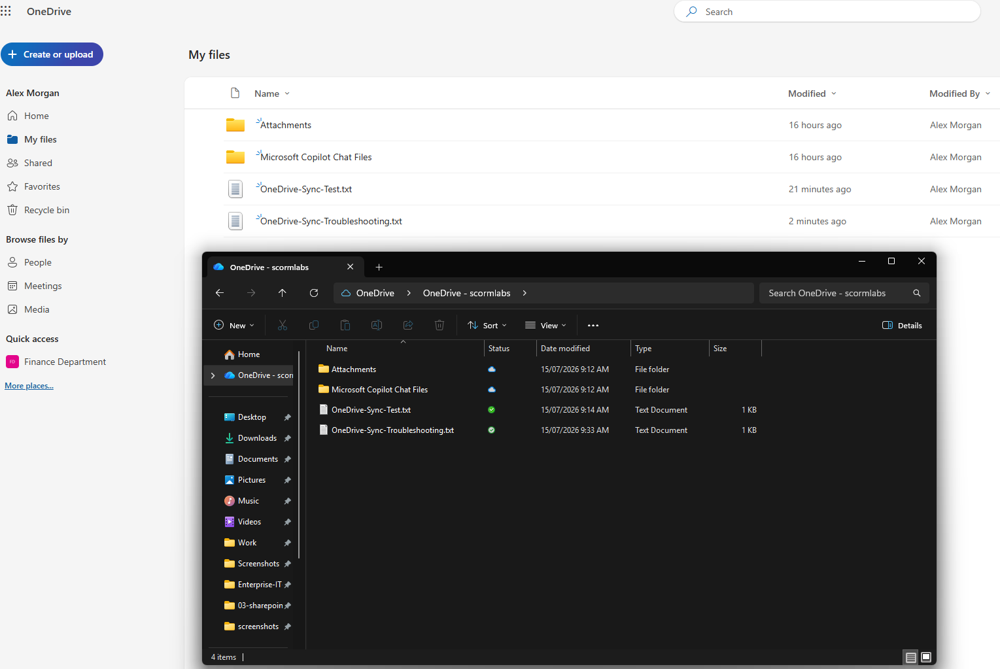

# OneDrive Sync Troubleshooting

## Overview

Simulated and resolved a OneDrive synchronisation issue by pausing the sync client, creating a local file, identifying the pending sync state, and restoring synchronisation.

## Skills Demonstrated

- Diagnosing OneDrive sync problems
- Inspecting OneDrive client status
- Identifying pending file synchronisation
- Restoring and validating successful sync

## Validation

OneDrive synchronisation was deliberately paused.

A new local file remained pending and did not appear in OneDrive on the web.

After synchronisation was resumed, the file successfully appeared in OneDrive on the web and showed as synced locally.

