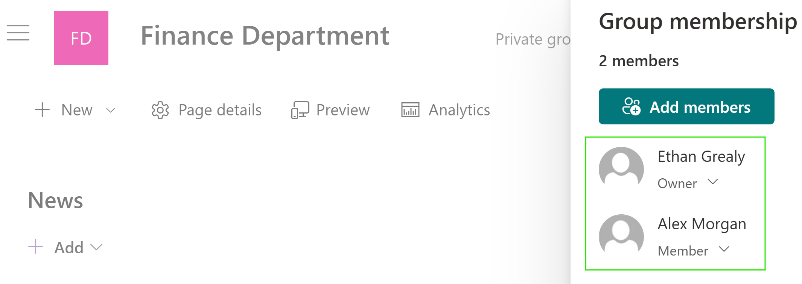
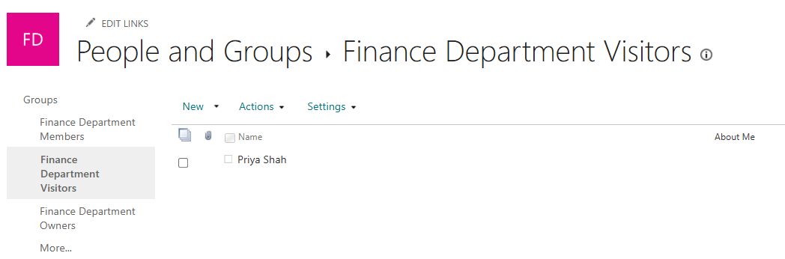
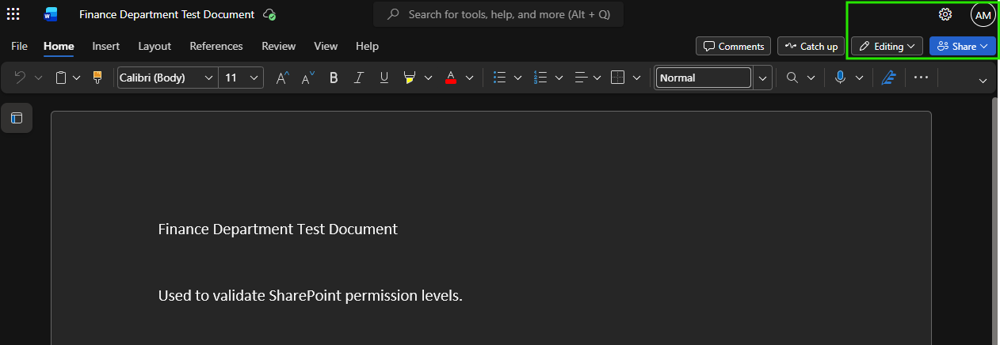
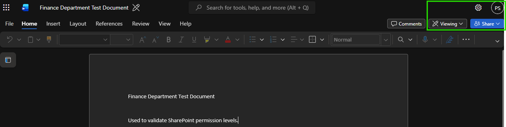

# SharePoint Permission Groups

## Overview

Configured and tested SharePoint permission groups for a Finance Department site.

## Skills Demonstrated

- Managing SharePoint Owners, Members, and Visitors
- Understanding Full Control, Edit, and Read permissions
- Assigning users to SharePoint permission groups
- Validating effective user access

## Validation

The site was configured with an Owner and Member.

Priya Shah was added to the Finance Department Visitors group.

Alex Morgan successfully accessed the document with editing permissions.

Priya Shah accessed the same document with read-only permissions.

