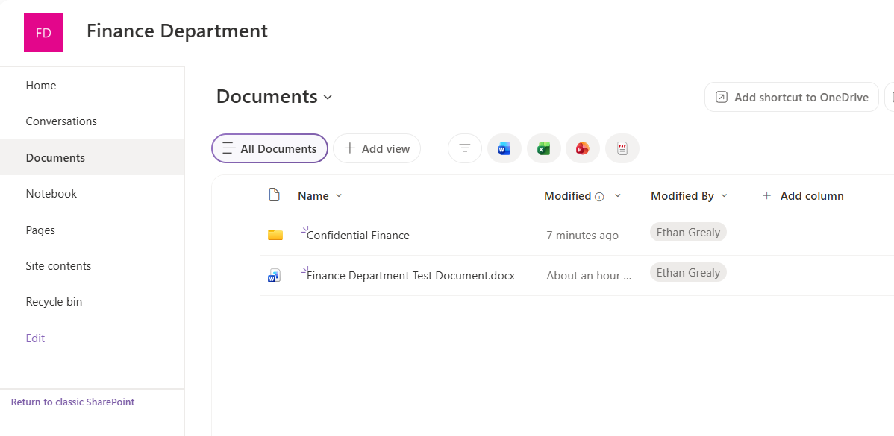
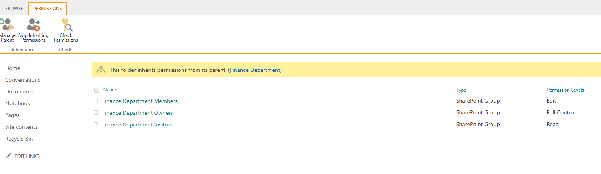
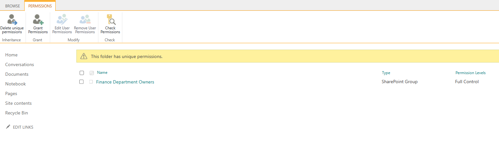
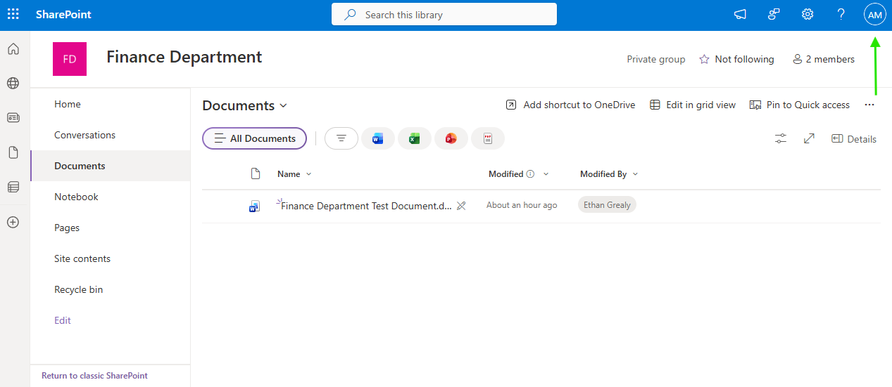

# SharePoint Permission Inheritance

## Overview

Configured and tested SharePoint permission inheritance for a confidential Finance folder.

## Skills Demonstrated

- Understanding inherited permissions
- Breaking permission inheritance
- Configuring unique permissions
- Restricting access to SharePoint content
- Validating effective access changes

## Validation

A Confidential Finance folder was created in the site's document library.

The folder initially inherited permissions from the parent site.

Permission inheritance was broken and the folder was configured with unique permissions for the Finance Department Owners group only.

The permission change was validated by confirming that the restricted user could no longer see the Confidential Finance folder.

