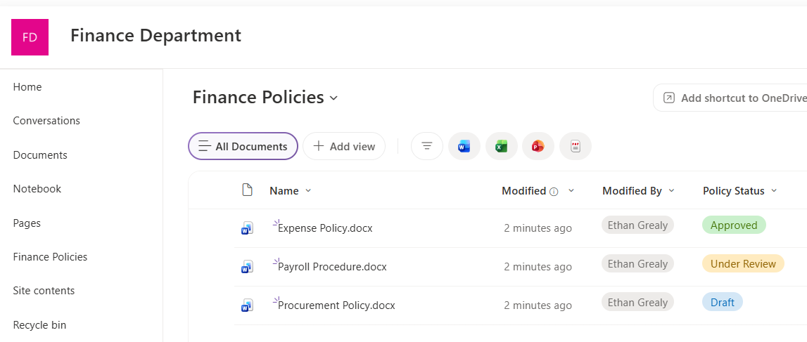
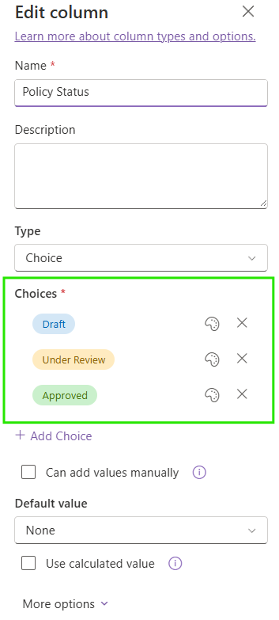
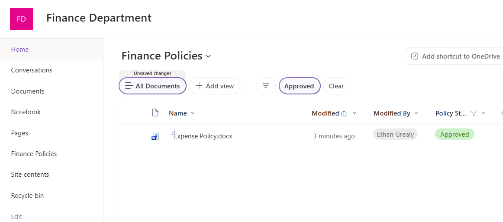

# SharePoint Document Libraries

## Overview

Created and configured a dedicated SharePoint document library for Finance policies.

## Skills Demonstrated

- Creating SharePoint document libraries
- Organising files using metadata
- Creating Choice columns
- Creating filtered library views

## Validation

A Finance Policies document library was created with three policy documents.

A custom Policy Status column was configured with Draft, Under Review, and Approved values.

An Approved view was created to display only approved policy documents.

