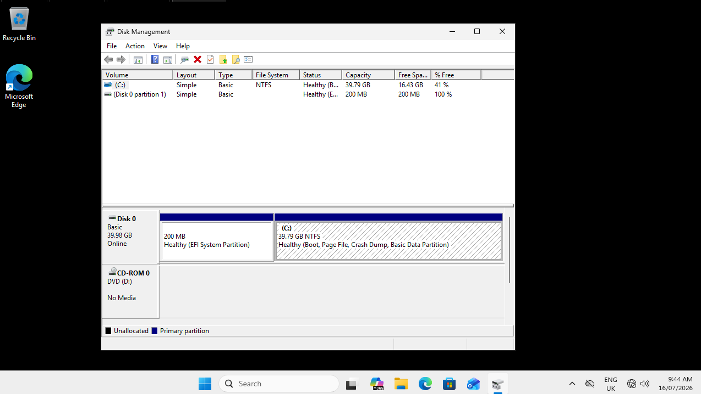
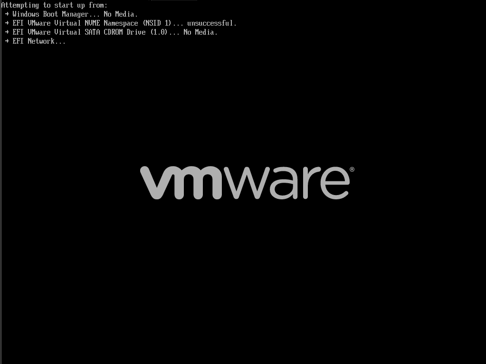
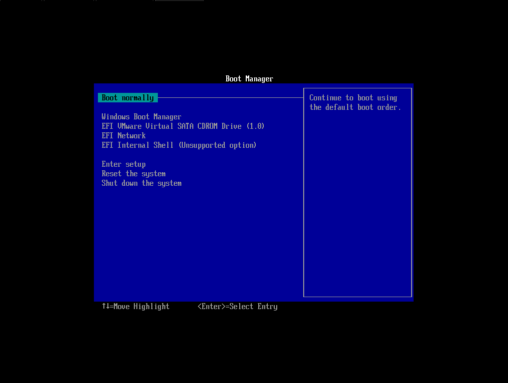
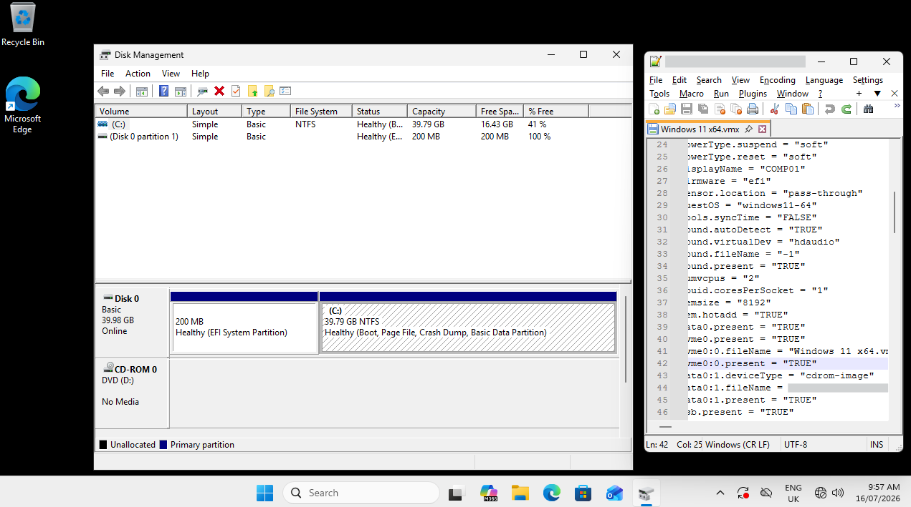

# No Bootable Device

## Overview

This project simulated a Windows 11 computer that could not detect its operating system drive.

The virtual NVMe disk was disabled in VMware to reproduce a missing, disconnected or failed SSD.

## Diagnosis

The system powered on and entered UEFI, but Windows could not start.

The boot screen showed:

- Windows Boot Manager — No Media
- NVMe device — Unsuccessful
- CD/DVD drive — No Media
- Network boot attempted

This confirmed that the operating system drive was unavailable before Windows could load.

## Resolution

The virtual NVMe disk was re-enabled in the VM configuration:

```text
nvme0:0.present = "TRUE"
```

Windows then booted normally, and Disk Management confirmed that the drive was online.

## Skills Demonstrated

- UEFI boot troubleshooting
- Boot-device diagnosis
- Disk Management
- Identifying a missing storage drive
- Verifying successful recovery

## Screenshots

### Healthy Disk Layout



### Boot Devices Unavailable



### UEFI Boot Manager



### Storage Restored

